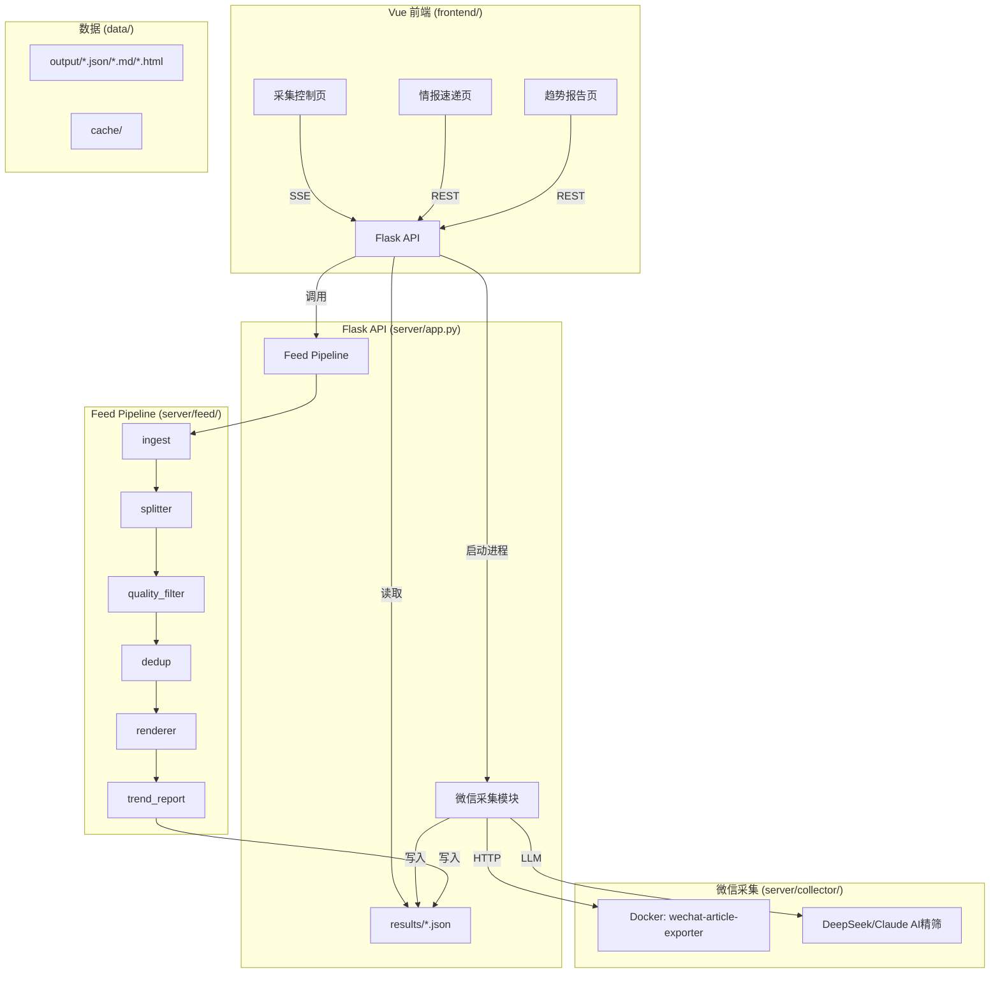

# 技术设计: wechat-intel 项目剥离与重构

## 1. 架构概述

新项目采用 **Python 后端 + Vue 前端** 分离架构，通过 Flask API 通信。



### 与原项目的关键差异

| 方面 | 原项目 (hr-intel-tavily) | 新项目 (wechat-intel) |
|------|-------------------------|----------------------|
| 数据源 | Tavily + Serper + 微信 | 仅微信公众号 |
| Web | Flask + Jinja2 模板 | Flask API + Vue SPA |
| 配置 | companies.yaml 含 search_priority | 精简版，去除 search_priority |
| 采集脚本位置 | wechat-collector/scripts/ | server/collector/ |
| Feed 模块位置 | feed/ | server/feed/ |
| 路径硬编码 | 多处硬编码 ~/hr-intel-tavily | 全部改为相对路径 |

## 2. 项目目录结构

```
wechat-intel/
├── README.md
├── .gitignore
├── .env.example
├── docker-compose.yml              # 微信 exporter 容器
│
├── server/                          # Python 后端
│   ├── app.py                       # Flask API 入口
│   ├── requirements.txt             # Python 依赖
│   │
│   ├── collector/                   # 微信采集模块（从 wechat-collector/scripts/ 迁移）
│   │   ├── __init__.py
│   │   ├── collector.py             # WechatCollector 类
│   │   ├── config.py                # 采集配置加载
│   │   └── watermark.json           # 采集水位线
│   │
│   ├── feed/                        # Feed Pipeline（从 feed/ 迁移）
│   │   ├── __init__.py
│   │   ├── models.py                # Article / Event / DigestEntry
│   │   ├── ingest.py                # 加载 *_wechat.json
│   │   ├── splitter.py              # LLM 多事件拆分
│   │   ├── quality_filter.py        # 事件质量精筛
│   │   ├── dedup.py                 # 三阶段去重
│   │   ├── renderer.py              # MD/JSON/HTML 渲染
│   │   ├── trend_report.py          # LLM 趋势归纳
│   │   └── pipeline.py              # 管道编排
│   │
│   └── config/                      # 配置文件
│       ├── companies.yaml           # 公司列表（精简版）
│       ├── wechat_channels.yaml     # 公众号配置
│       ├── feed_settings.yaml       # Pipeline 参数
│       ├── source_credibility.yaml  # 来源可信度
│       └── prompts/                 # LLM prompt 模板
│           ├── hr-filter.md
│           ├── event_split.md
│           ├── event_quality.md
│           ├── dedup_judge.md
│           └── trend-extract.md
│
├── data/                            # 运行时数据（gitignore）
│   ├── cache/
│   │   └── results/                 # 采集输出 JSON
│   └── output/                      # Pipeline 输出
│
└── frontend/                        # Vue 前端
    ├── package.json
    ├── vite.config.js
    ├── index.html
    ├── tailwind.config.js
    ├── postcss.config.js
    └── src/
        ├── main.js
        ├── App.vue
        ├── router/
        │   └── index.js
        ├── views/
        │   ├── CollectView.vue      # 采集控制页
        │   ├── FeedView.vue         # 情报速递页
        │   └── ReportView.vue       # 趋势报告页
        ├── components/
        │   ├── AppLayout.vue        # 布局/导航
        │   ├── EventCard.vue        # 事件卡片
        │   ├── FilterBar.vue        # 筛选栏
        │   └── LogStream.vue        # SSE 日志流
        └── api/
            └── index.js             # API 封装
```

## 3. 数据模型/接口设计

### 3.1 数据模型（沿用原项目，无变更）

- **Article**: 从 JSON 加载的原始文章
- **Event**: 拆分后的独立事件 (company, event_date, dimension, summary, detail, confidence, source_url, source_account)
- **DigestEntry**: 去重后的最终条目 (canonical: Event, source_count, all_sources, all_urls)

### 3.2 Flask API 端点

| 方法 | 路径 | 说明 | 请求/响应 |
|------|------|------|----------|
| GET | `/api/collect/status` | 采集状态 | → `{running: bool, log_count: int}` |
| POST | `/api/collect/run` | 启动采集 | `{start_date, end_date}` → `{status, message}` |
| GET | `/api/collect/log` | SSE 日志流 | → SSE `{line}` / `{done: true}` |
| GET | `/api/collect/watermark` | 水位线数据 | → `{accounts: {...}}` |
| GET | `/api/feed` | 情报速递数据 | `?month=2026年3月` → `{entries: [...], date_label, ...}` |
| GET | `/api/feed/months` | 可用月份列表 | → `["2026年3月", "2026年2月"]` |
| POST | `/api/feed/generate` | 触发 Pipeline | `{month, no_dedup?, no_split?}` → `{status, event_count, ...}` |
| GET | `/api/report` | 趋势报告数据 | `?month=2026年3月` → `{trends: [...], stats: {...}, ...}` |

### 3.3 需要解耦的硬编码路径

| 原代码位置 | 硬编码内容 | 修复方案 |
|-----------|-----------|---------|
| `collector/config.py:76` | `EXPORT_DIR = "/Users/shihang/hr-intel-tavily/..."` | 改为 `os.path.join(ROOT, 'data', 'cache', 'results')` |
| `collector/config.py:88-89` | 默认日期硬编码 | 改为动态计算当月 |
| `collector/config.py:105` | DeepSeek API Key 硬编码 | 统一从 `.env` 读取 |
| `collector/collector.py:119` | `'..', '..', 'config'` 相对路径 | 适配新目录结构 |
| `feed/splitter.py:15` | `CACHE_DIR` 绝对路径拼接 | 改为基于 ROOT 的相对路径 |
| `feed/dedup.py:35-38` | `companies.yaml` 路径 | 适配新 config 位置 |
| `feed/quality_filter.py:32-34` | prompt 文件路径 | 适配新 config/prompts 位置 |
| `feed/trend_report.py:17` | prompt 文件路径 | 适配新 config/prompts 位置 |

## 4. 关键组件与测试策略

### 4.1 迁移优先级

1. **P0 — 基础结构**: 项目脚手架、配置文件、数据模型
2. **P1 — 采集模块**: collector.py + config.py，解耦路径，统一环境变量
3. **P2 — Feed Pipeline**: 6个模块整体迁移，适配新路径
4. **P3 — Flask API**: 路由层，串联采集和Pipeline
5. **P4 — Vue 前端**: 3个页面实现

### 4.2 Vue 前端技术选型

| 库 | 版本 | 用途 |
|----|------|------|
| Vue | 3.x | 框架 |
| Vue Router | 4.x | SPA 路由 |
| Vite | 5.x | 构建工具 |
| TailwindCSS | 3.x | 样式 |
| Axios | 1.x | HTTP 客户端 |

### 4.3 开发/运行方式

- **开发模式**: `cd frontend && npm run dev`（Vite 代理 API 到 Flask:5001）+ `cd server && python app.py`
- **生产模式**: `npm run build` → Flask 静态文件服务 `frontend/dist/`

### 4.4 测试策略

- **采集模块**: 手动验证（依赖Docker容器+微信登录，无法自动化）
- **Feed Pipeline**: 用已有的 `data/cache/results/` 数据文件运行 Pipeline，验证输出正确
- **API**: 用 curl/httpie 验证各端点返回格式
- **前端**: 浏览器手动验证3个页面的交互和数据展示
