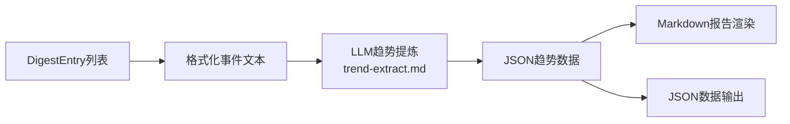

# 技术设计: 趋势分析优化 V2

## 1. 架构概述

趋势分析是 pipeline 的最后一步（Step 6/6），输入为去重后的 `DigestEntry` 列表，输出为 Markdown 报告 + JSON 数据。

改动范围集中在两个文件：
- `server/config/prompts/trend-extract.md` — LLM prompt（核心改动）
- `server/feed/trend_report.py` — 趋势生成 + 渲染逻辑



现有架构无需改变，只需：
1. 重写 prompt 提升提炼质量
2. 扩展 LLM 输出格式（增加 implications 字段）
3. 优化 Markdown 渲染模板（增加执行摘要、启示建议）

## 2. 接口设计

### LLM 输入（prompt 改动）

**当前问题：**
- prompt 过于通用，缺乏行业视角引导
- 没有要求"启示建议"
- 趋势标题格式不够战略化

**改进后 prompt 核心要点：**
1. 角色设定：龙湖集团CHO团队的外部HR市场分析顾问
2. 趋势维度引导（非强制）：激励管理、组织架构、价值评估、组织提效、AI策略、人才流动
3. 每条趋势增加 `implications` 字段：从龙湖/地产行业视角的启示
4. 增加 `executive_summary` 字段：2-3句话的月度总结
5. 明确"不是所有事件都需要归类"

### LLM 输出格式

```json
{
  "executive_summary": "本月HR市场最显著的趋势是...",
  "trends": [
    {
      "title": "趋势标题（战略视角）",
      "summary": "1-2句话概括趋势方向",
      "implications": "对龙湖/地产行业的启示与建议",
      "event_indices": [0, 3, 7]
    }
  ]
}
```

### Markdown 报告结构

```
# HR 市场情报趋势分析报告 — {date_label}

## 执行摘要
{executive_summary}

## 趋势1: {title}
**趋势概述**: {summary}
**启示与建议**: {implications}
### 关联事件
- 事件1...
- 事件2...

---

## 其他动态
- 未归类事件列表
```

## 3. 关键组件与测试策略

### 组件分解

| 组件 | 文件 | 改动内容 |
|---|---|---|
| **趋势提炼 prompt** | `server/config/prompts/trend-extract.md` | 完全重写：角色设定、维度引导、输出格式扩展 |
| **LLM 调用逻辑** | `server/feed/trend_report.py` `_llm_extract_trends()` | 适配新的 JSON 输出格式（从数组改为对象） |
| **事件格式化** | `server/feed/trend_report.py` `_format_events_for_llm()` | 增加 excerpts 摘要，提供更多上下文给 LLM |
| **Markdown 渲染** | `server/feed/trend_report.py` `render_trend_markdown()` | 增加执行摘要、启示建议、优化排版 |
| **JSON 输出** | `server/feed/trend_report.py` `generate_trend_report()` | 返回值增加 executive_summary、implications |

### 测试策略

- **端到端测试**: 重跑 `python3 -m server.feed.pipeline`，对比新旧趋势报告
- **prompt 质量验证**: 人工审阅趋势标题、摘要、启示的质量
- **JSON 格式兼容**: 确保新格式不破坏 pipeline 其他部分
- **降级策略**: LLM 返回旧格式（纯数组）时自动兼容
