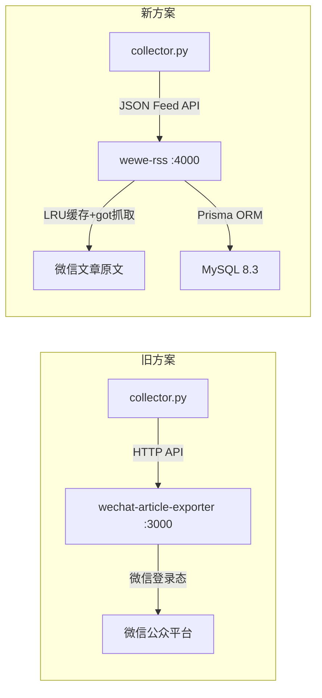
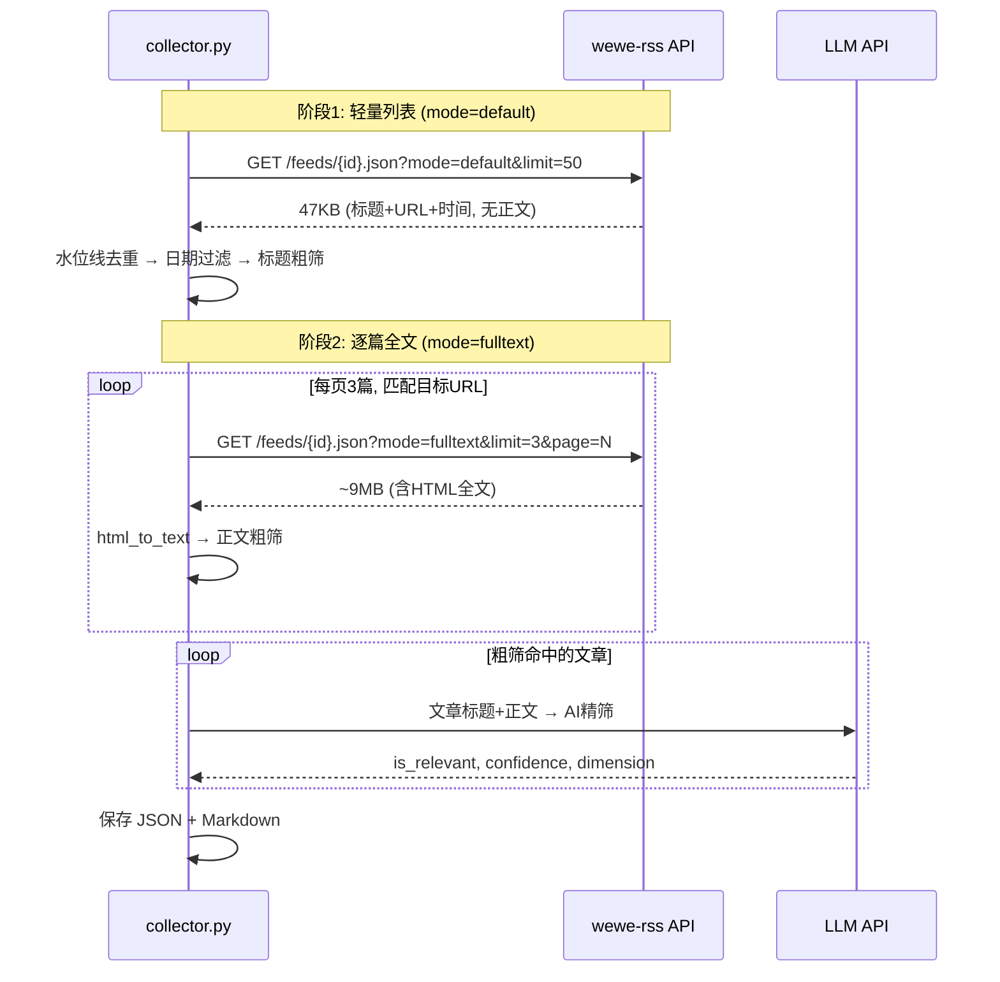

# 技术设计: wewe-rss 数据源迁移

## 1. 架构概述

### 迁移前后对比



### 两阶段采集流程



## 2. 数据模型/接口设计

### wewe-rss API 接口

| 端点 | 用途 | 关键参数 |
|------|------|----------|
| `GET /feeds` | 获取订阅源列表 | - |
| `GET /feeds/{id}.json` | 获取公众号文章 | `mode=default\|fulltext`, `limit`, `page`, `title_include` |

### wewe-rss 数据库结构（MySQL, 只读参考）

| 表 | 关键字段 | 说明 |
|----|----------|------|
| feeds | id, mp_name, sync_time, update_time | 订阅的公众号 |
| articles | id, mp_id, title, publish_time | 文章元数据（无正文） |

> 注意: 正文不存数据库，由 wewe-rss NestJS 应用的 LRU 缓存（max 5000）持有，通过 got 库从微信原文 URL 抓取。

### 新增后端 API

```
GET /api/collect/feeds
→ 代理查询 wewe-rss /feeds，返回订阅源状态
→ Response: { status: "ok"|"error", feeds: [...], url: "..." }
```

### 输出文件格式（不变）

```json
{
  "source": "wechat",
  "account_name": "涛哥杂谈",
  "articles": [
    {
      "title": "...",
      "url": "https://mp.weixin.qq.com/s/...",
      "content": "纯文本正文",
      "published_at": "2026-03-25",
      "ai_summary": "...",
      "dimensions": ["薪酬激励", "组织架构"]
    }
  ]
}
```

## 3. 关键组件与测试策略

### 组件分解

| 组件 | 文件 | 变更类型 |
|------|------|----------|
| 配置模块 | `server/collector/config.py` | 重写: WEWE_RSS_URL, feed_id 加载 |
| 采集器核心 | `server/collector/collector.py` | 重写: 两阶段拉取, html_to_text |
| 公众号配置 | `server/config/wechat_channels.yaml` | 新增: feed_id 字段 |
| Flask API | `server/app.py` | 新增: /api/collect/feeds 端点 |
| 前端采集页 | `frontend/src/views/CollectView.vue` | 新增: 订阅源状态卡片 |
| 环境配置 | `.env.example`, `docker-compose.yml` | 更新: 移除 exporter, 添加 wewe-rss |

### 性能数据

| 指标 | 旧方案 (fulltext) | 新方案 (两阶段) |
|------|-------------------|-----------------|
| 列表获取 (100篇) | ~300MB, 超时 | **47KB, 15ms** |
| 单公众号采集 | 超时失败 | **~30秒** |
| 数据传输量 | ~300MB/公众号 | ~20-60MB/公众号 |

### 测试策略

* **单元验证**: `python3 -c "import py_compile; ..."` 语法检查
* **单公众号测试**: `python3 -m server.collector.collector --no-ai --account "涛哥杂谈"`
* **全量测试**: 前端触发12个公众号采集，含 AI 精筛
* **前端验证**: Playwright 截图验证订阅源卡片、水位线、日志流

### 已知限制

1. wewe-rss 分页有重叠（同一篇文章可能出现在相邻两页），通过 URL 去重解决
2. fulltext 分页匹配目标 URL 时可能有少量遗漏（~5/22），通过 miss_streak=5 退出避免无效翻页
3. 5个公众号未在 wewe-rss 订阅（巨潮资讯、地产人力V圈、地产周侃、HR研究网、地产人才官）
